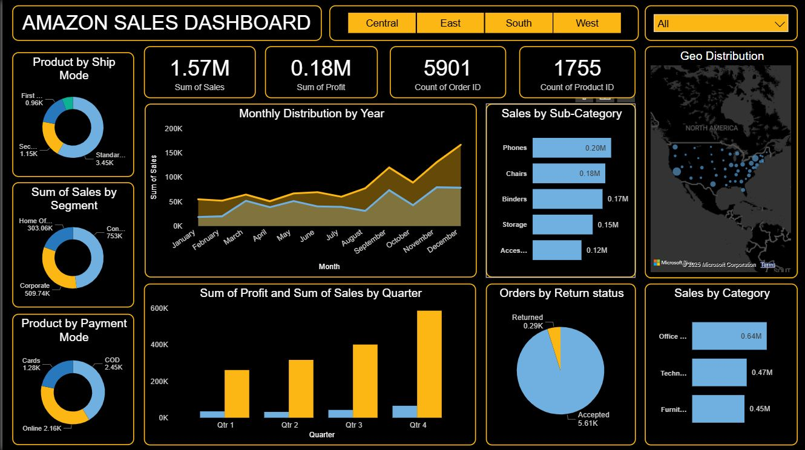

# 🛒 Amazon Sales Analysis Dashboard | Power BI

## 📌 Project Overview

This project presents an interactive Amazon Sales Analysis Dashboard developed using Microsoft Power BI.

The dashboard analyzes sales, profit, orders, products, categories, customer segments, shipping modes, payment methods, returns, and regional performance to identify business trends and generate actionable insights.

The objective is to transform raw e-commerce data into an interactive business intelligence solution that supports data-driven decision-making.

---

## 🎯 Business Objectives

The dashboard was designed to answer key business questions such as:

- What is the overall sales and profit performance?
- Which product categories generate the highest sales?
- Which sub-categories contribute the most revenue?
- Which customer segments generate the most sales?
- How do sales change across months and quarters?
- Which shipping modes are most commonly used?
- What payment methods are most frequently used?
- What is the distribution of returned and accepted orders?
- How is sales performance distributed geographically?
- Which regions contribute most to overall sales?

---

## 🛠️ Tools & Technologies

- **Microsoft Power BI**
- **Microsoft Excel**
- **Power Query**
- **DAX**
- **Data Visualization**
- **Business Intelligence**

---

## 📊 Key Performance Indicators

| KPI | Value |
|---|---:|
| Total Sales | 1.57M |
| Total Profit | 0.18M |
| Total Orders | 5,901 |
| Total Products | 1,755 |

---

## 📈 Dashboard Features

### Sales & Profit Analysis

- Total sales and profit performance
- Monthly sales trends
- Quarterly sales and profit comparison
- Sales by category
- Sales by sub-category

### Customer Analysis

- Sales by customer segment
- Customer segment comparison
- Product distribution by customer segment

### Product & Order Analysis

- Product performance
- Product count analysis
- Order volume analysis
- Return status analysis

### Shipping & Payment Analysis

- Sales by shipping mode
- Product distribution by shipping mode
- Payment mode analysis

### Geographic Analysis

- Geographic sales distribution
- Regional performance
- Region-level filtering

### Interactive Filtering

The dashboard includes filters for:

- Central
- East
- South
- West
- Overall region selection

---

## 🔍 Key Insights

- **Phones** generated the highest sales among the analyzed sub-categories.
- **Office Supplies** was the strongest overall category based on sales.
- Sales increased significantly toward the later months of the year.
- **Q4** recorded the strongest sales performance compared with the other quarters.
- The **Consumer** segment contributed the highest sales among the analyzed customer segments.
- Standard shipping represented the largest share of shipping activity.
- Most orders were **accepted**, with a smaller proportion returned.
- Sales were concentrated across major geographic areas in the United States.

---

## 💡 Business Recommendations

Based on the analysis:

1. Prioritize high-performing categories and sub-categories for inventory and promotional planning.
2. Focus marketing strategies on high-value customer segments, particularly Consumer customers.
3. Use monthly and quarterly sales trends to improve seasonal inventory planning.
4. Monitor returned orders to identify potential product or fulfillment issues.
5. Optimize shipping strategies based on customer demand and shipping-mode usage.
6. Analyze regional performance to identify opportunities for geographic expansion.

---

## 🖥️ Dashboard Preview



---

## 📁 Project Structure

```text
amazon-sales-powerbi/
│
├── README.md
│
├── Dashboard/
│   └── Amazon-Sales-Dashboard.pbix
│
├── Dataset/
│   └── amazon-sales-dataset.xlsx
│
├── Documentation/
│   ├── amazon-sales-project-report.pdf
│   └── amazon-sales-project-presentation.pptx
│
└── Screenshots/
    └── amazon-sales-dashboard.jpeg


---

## 🧩 Skills Demonstrated

- Data Cleaning
- Data Transformation
- Data Modeling
- DAX
- KPI Development
- Data Visualization
- Interactive Dashboard Development
- Business Analysis
- Power BI Reporting
- Insight Generation

---

## 👨‍💻 Author

**Rohith Gowda**

Data Analyst | Power BI | SQL | Python | Excel

📍 Bengaluru, Karnataka, India
